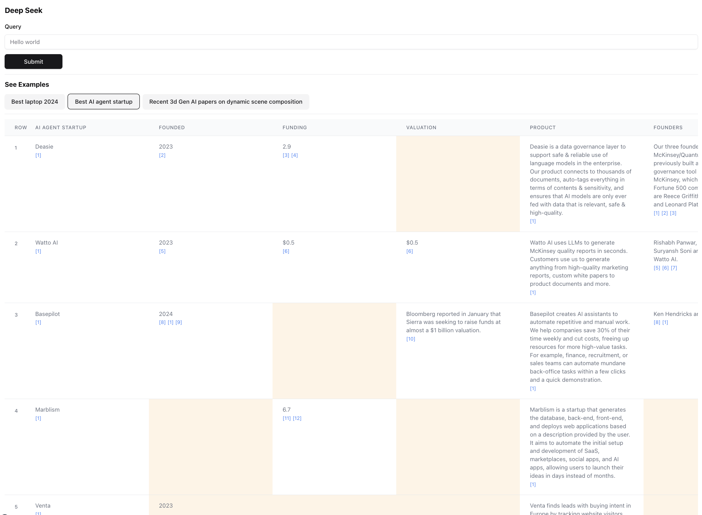

# DeepSeek

This is a new experimental architecture for a llm powered internet scale _retrieval engine_. This architecture is very different from current research agents, which are designed as _answer engines_.

You can see some example results here: [https://deep-seek.vercel.app/](https://deep-seek.vercel.app/) (Note that this won't let you do real queries, since I won't be able to afford it 😅)

The main difference between the 2 concepts breaks down to:

- Answer engine: aggregate a ton of sources to find the one correct answer
- Retrieval engine: process a ton of sources to collect a list of entities for enrichment

The end result for an answer engine is a research report, the end result for a retrieval engine is a table with all the retrieved entities and enriched columns.

Here's what the end result looks like (zoomed out for scale):


This is infact a small portion of the result for this query. The actual result is so large it's impossible to screenshot. There are 94 records in the final result, which the agent gathered & enriched after browsing through 356 sources.

The agent also generates a confidence score for the data in the table cells as it is enriching. Note that there are certain cells highlighted in yellow - those are cells with low confidence. Those are cases where the sources may conflict, or there are no sources at all so the agent made a best guess. This is actually a number between 0 - 1, so there can definitely be better & more creative UI to showcase the score in higher fidelity.

## Getting Started

To run the dev server

```bash
npm run dev
# or
yarn dev
# or
pnpm dev
# or
bun dev
```

Open [http://localhost:3000](http://localhost:3000) with your browser to start searching or explore the pre-built examples. Note that the examples won't actually run the agent (it costs a lot of $), it's more there to show the power and the flaws of the architecture by letting you inspect the results.

If you have the environment variables set, you can run it for yourself. Note that it takes ~5 min and could cost anywhere between $0.1 - $3 worth of credits, depending on number of entities retrieved and amount of data that needs to be enriched.

When running the agent, check the terminal to see logs of what's happening behind the scenes.

### Environment Variables

Make sure you have API keys for [Anthropic](https://anthropic.com) and [Exa](https://exa.ai).

Create a .env file, and put in the following environment variables:

```
ANTHROPIC_KEY="anthropic_api_key"
EXA_KEY="exa_api_key"
```

## Architecture

The research pipeline is split into 4 main steps:

1. Plan - based on the user query, the planner constructs what the shape of the end result would look like. It does this by defining the type of entity to extract, as well as the different columns in the resulting table. The columns represent additional data that is relevant for the user's query relating to the entities.

2. Search - we use both standard keyword search and neural search to find relevant content to process (both types of search are provided by [Exa](https://exa.ai)). Keyword search is great at finding user generated content talking about the entities to befound (e.g. reviews, listicles.. etc). Neural search is great at finding specific entities themselves (e.g. companies, papers.. etc).

3. Extract - all content found in search is processed via LLM to extract specific entities and its associated contents. This is done via a new technique I'm testing out where special tokens are inserted between sentences (split via winkNLP's small language model) in the content, and the LLM is tasked with defining the range of content to extract by indicating the start & end tokens. This is super fast & token efficient.

4. Enrich - we do actually have a smaller answer agent within this bigger retrieval agent, whose job is to enrich all the columns defined by the planner for every entity. This is the most time consuming part of the entire process, but it is also the reason why this agent is extremely thorough.

Here's a more detailed flow of how it works:


## Future Work

- Sorting / ranking the retrieved entities by relevance - this is especially important for queries that's requesting things like "Best of" or "Fastest of"... etc.

- Better entity resolution to detect duplicated entities - the agent still get stumped by things like M2 vs M3 Macbooks sometimes, there are techniques to [better format entity titles](https://eugeneyan.com/writing/product-categorization-api-part-2-data-preparation/) that could lead to better performance here.

- Related to previous point, better verification of sources when enriching to ensure that it is connected to the orginal entity.

- Support for deep browsing of sources - sometimes the agent should click around the web page to really drill into the content, this will be required to do a good job on searching through research papers on arxiv, for example.

- Support for streaming in the data - it would be amazing to see the list populated & cells being enriched in real-time in the UI. Right now you can only get a sense of progress by watching the logs on the terminal.
